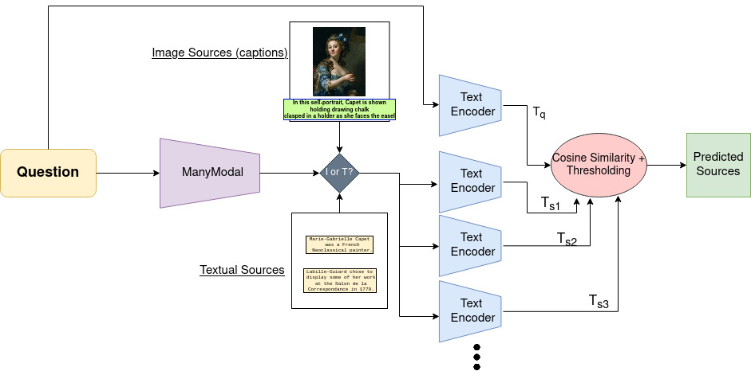

# LeapFrog

Data found on the web generally spans numerous domains and is multi-hop in nature. To build reliable robust automated systems, pipelines would be expected to excel in various tasks such as visual representation learning, knowledge aggregation, cross-modality learning, and question answering. Motivated by the challenges faced in these tasks, we develop Leap Frog, a unified model capable of multimodal question answering. Leap Frog is built based on the models and data provided in WebQA, a well-designed dataset that encourages a good balance between visual performance and language understanding. Leap Frog aims at harmoniously utilizing both visual and textual inputs to answer a given textual question. This would consist of on the one hand choosing the right knowledge sources to aggregate and on the other hand, producing a fluent answer using these sources. We plan to evaluate our model using metrics such as the accuracy and fluency of the answers produced. Furthermore, we aim at conducting analytical studies on the usage of different visual and textual encoders, which may help in producing a better representation of the knowledge sources, which can implicitly help in improving the system’s overall performance and robustness.

# Source retrieval Model

# Results
| Model                              | Source retrieval F1 |
|------------------------------------|---------------------|
| BERT ([pre-trained](https://huggingface.co/docs/transformers/model_doc/bert))               | 18.49               |
| CLIP ([pre-trained](https://huggingface.co/docs/transformers/main/en/model_doc/clip#overview))                 | 16                  |
| Sentence Transformer ([pre-trained](https://www.sbert.net/)) | 20.2                |
| BERT w Contrastive Loss(Ours)            | 45.3                |

# Final Report
[Final Report](/report/11785_Project___Final.pdf)

# Team Members
* Divija Nagaraju
* Gabriel Moreira
* Nikhil Madaan
* Rohan Panda 

# Acknowledgements

This repository is developed upon the original repository for WebQA [found here](https://github.com/WebQnA/WebQA_Baseline).

We would like to thank the authors of WebQA for their valuable works and for making the data and code available.
Special thanks to [Yingshan Chang](https://github.com/zdxdsw) and [Jeff Moore](https://lti.cs.cmu.edu/people/222227077/jeffrey-moore) for guiding us throughout the project.
